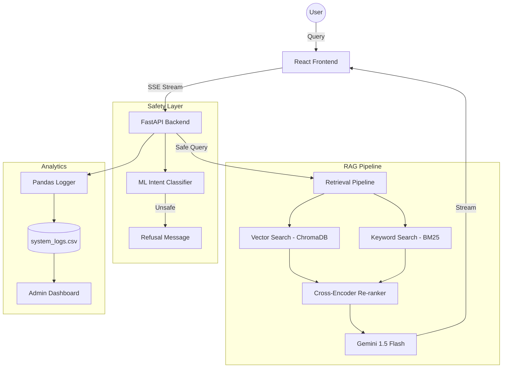

# MedLens AI: Medical Research Assistant 🧬

[](https://www.python.org/)
[](https://reactjs.org/)
[](https://fastapi.tiangolo.com/)
[](https://opensource.org/licenses/MIT)

**MedLens AI** is a production-grade Retrieval-Augmented Generation (RAG) system designed to explore, understand, and synthesize complex medical research. By leveraging state-of-the-art Natural Language Processing and Vector Search, researchers can securely query clinical literature and receive highly accurate, **evidence-backed** answers with direct source citations.

---

## 🚀 Key Features

### 🔍 Advanced Retrieval Pipeline
- **Hybrid Search**: Combines dense vector embeddings (`all-MiniLM-L6-v2` via ChromaDB) with sparse keyword search (`BM25`) for maximum recall.
- **Cross-Encoder Re-Ranking**: Uses `ms-marco-MiniLM-L-6-v2` to mathematically re-score results, ensuring the most relevant context is prioritized for the LLM.

### 🛡️ Safety-First Architecture
- **ML Intent Classifier**: A custom `SGDClassifier` intercepts diagnosis or treatment requests *before* they reach the LLM, replacing naive keyword filters with robust Data Science.
- **Hallucination Prevention**: Strict prompt engineering ensures the system only answers based on provided evidence, refusing unsupported or unsafe queries.

### 📊 Enterprise Analytics & Evaluation
- **RAGAS Diagnostics**: Built-in `/admin` dashboard provides real-time scores for **Context Precision**, **Faithfulness**, and **Answer Relevancy**.
- **Pandas Telemetry**: Every query is logged with its ML classification and end-to-end latency, visualized through dynamic `recharts` dashboards.

### ⚡ Modern Clinical UI
- **Streaming Responses**: Ultra-low perceived latency via Server-Sent Events (SSE).
- **Voice Dictation**: Hands-free interaction powered by the Web Speech API.
- **Dynamic Ingestion**: Upload and instantly parse medical PDFs for real-time knowledge base expansion.

---

## 🏗️ System Architecture



---

## 🛠️ Installation & Setup

### 1. Quick Start (Windows)
We provide a PowerShell script for automated setup:
```powershell
./setup_project.ps1
```

### 2. Manual Backend Setup
```bash
cd backend
python -m venv venv
source venv/bin/activate # Windows: venv\Scripts\activate
pip install -r requirements.txt
cp .env.example .env # Add your GOOGLE_API_KEY to .env
python src/train_classifier.py
uvicorn src.api:app --reload
```

### 3. Manual Frontend Setup
```bash
cd frontend
npm install
npm run dev
```

---

## 📁 Project Structure

```text
├── backend/
│   ├── src/                # Core RAG logic, API, and Training
│   ├── data/               # Persistent storage and test docs
│   ├── models/             # ML checkpoints and metadata
│   ├── tests/              # Pytest & RAGAS evaluation
│   └── scripts/            # Utility and data generation scripts
├── frontend/
│   ├── src/                # React components and styling
│   └── public/             # Static assets
├── setup_project.ps1       # One-click setup script
└── README.md               # You are here
```

---

## 🛡️ Safety & Disclaimer
This system employs a multi-layered safety architecture including ML-driven intent classification and strict prompt guardrails.

**This system provides research summaries, not medical advice. Always consult a healthcare professional for diagnosis and treatment.**

---

## 📄 License
This project is licensed under the MIT License - see the [LICENSE](LICENSE) file for details.
