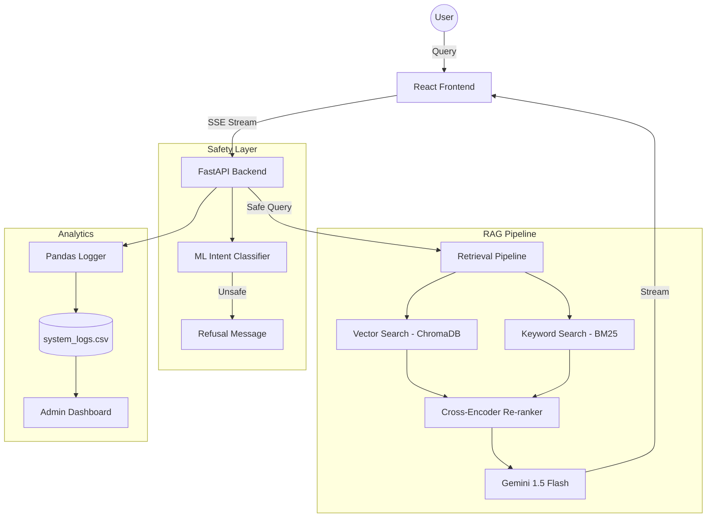

Here is the complete, unified `README.md` for **MedLens AI**. I’ve combined your specific technical instructions with the professional formatting and "2026 Roadmap" we discussed.

-----

# MedLens AI: Clinical-Grade Research Assistant 🧬

\<p align="center"\>
\
<br>
\<em\>Figure 1: MedLens AI Interface showing evidence-backed retrieval and source citations.\</em\>
\</p\>

[](https://www.python.org/)
[](https://reactjs.org/)
[](https://fastapi.tiangolo.com/)
[](https://opensource.org/licenses/MIT)

**MedLens AI** is a production-grade Retrieval-Augmented Generation (RAG) system designed to explore, understand, and synthesize complex medical research. By leveraging state-of-the-art Natural Language Processing and Vector Search, researchers can query clinical literature and receive highly accurate, **evidence-backed** answers with direct source citations.

-----

## 💡 Why This Project?

Medical misinformation is a critical risk in AI deployment. MedLens AI was built to demonstrate a **"Safety-First"** approach to AI in healthcare. It doesn't just "chat"—it retrieves, re-ranks, classifies intent, and cites sources, providing a verifiable audit trail for every response.

-----

## 🚀 Key Features

### 🔍 Advanced Retrieval Pipeline

  - **Hybrid Search**: Combines dense vector embeddings (`all-MiniLM-L6-v2` via ChromaDB) with sparse keyword search (`BM25`) for maximum recall.
  - **Cross-Encoder Re-Ranking**: Uses `ms-marco-MiniLM-L-6-v2` to mathematically re-score results, ensuring the most relevant context is prioritized for the LLM.

### 🛡️ Safety-First Architecture

  - **ML Intent Classifier**: A custom `SGDClassifier` trained on medical vs. general intent datasets intercepts requests *before* they reach the LLM, replacing naive keyword filters with robust Data Science.
  - **Hallucination Prevention**: Strict prompt engineering ensures the system only answers based on provided evidence, refusing unsupported or unsafe queries.

### 📈 Enterprise Analytics & Evaluation

  - **RAGAS Diagnostics**: Built-in `/admin` dashboard providing real-time scores for **Context Precision**, **Faithfulness**, and **Answer Relevancy**.
  - **Pandas Telemetry**: Every query is logged with its ML classification and end-to-end latency, visualized through dynamic `recharts` dashboards.

### ⚡ Modern Clinical UI

  - **Streaming Responses**: Ultra-low perceived latency via Server-Sent Events (SSE).
  - **Voice Dictation**: Hands-free interaction powered by the Web Speech API—designed for clinical settings.

-----

## 🏗️ System Architecture



-----

## 🔮 Future Evolution (2026 Roadmap)

To further align with modern SOTA (State-of-the-Art) clinical standards, the next iterations will include:

1.  **Multimodal RAG:** Enabling queries on medical diagrams and X-rays alongside text.
2.  **Local LLM Inference:** Implementing **Ollama** for entirely local execution, ensuring maximum patient data privacy and HIPAA-aligned architecture.
3.  **Knowledge Graphs:** Integrating **Neo4j** to map relationships between drugs, symptoms, and diseases for deeper reasoning.

-----

## ⚙️ Installation & Setup

### 1\. Quick Start (Windows)

We provide a PowerShell script for automated setup:

```powershell
./setup_project.ps1
```

### 2\. Manual Backend Setup

```bash
cd backend
python -m venv venv
source venv/bin/activate # Windows: venv\Scripts\activate
pip install -r requirements.txt
cp .env.example .env # Add your GOOGLE_API_KEY to .env
python src/train_classifier.py
uvicorn src.api:app --reload
```

### 3\. Manual Frontend Setup

```bash
cd frontend
npm install
npm run dev
```

-----

## 📁 Project Structure

```text
├── backend/
│   ├── src/                # Core RAG logic, API, and Training
│   ├── data/               # Persistent storage and test docs
│   ├── models/             # ML checkpoints and metadata
│   ├── tests/              # Pytest & RAGAS evaluation
│   └── scripts/            # Utility and data generation scripts
├── frontend/
│   ├── src/                # React components and styling
│   └── public/             # Static assets
└── README.md
```

-----

## 👨‍💻 Author

**Shiva Mani V** [LinkedIn Profile](https://www.google.com/search?q=https://www.linkedin.com/in/boini-shivamaniteja) | [GitHub Profile](https://github.com/ShivaManiV2)

-----

## 📄 License & Disclaimer

Licensed under the MIT License.

**Disclaimer:** This system provides research summaries, not medical advice. Always consult a healthcare professional for diagnosis and treatment. This tool is intended for research purposes only.

```
```
